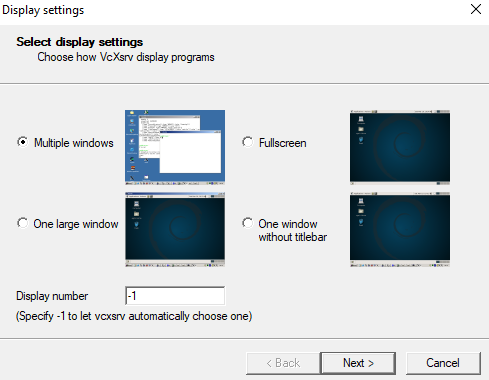
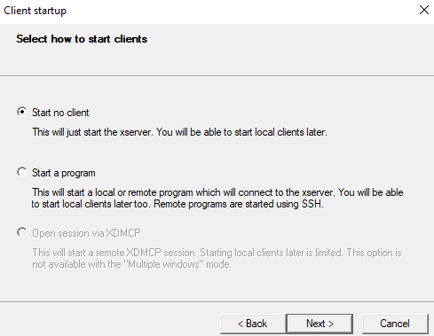
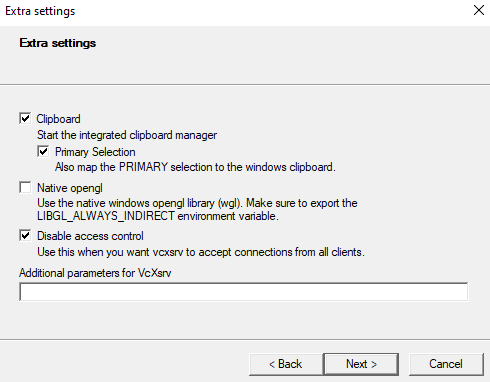

# skat [](https://github.com/Dichloromethane/skat/blob/master/LICENSE)

[](https://github.com/Dichloromethane/skat)
[](https://github.com/Dichloromethane/skat)
[](https://github.com/Dichloromethane/skat/actions?query=workflow%3Abuild)
[](https://github.com/Dichloromethane/skat/actions?query=workflow%3Ashellcheck)
[](https://github.com/Dichloromethane/skat/actions?query=workflow%3Amarkdownlint)

---

**Skat** is a client-server application to play a round of Skat with multiple players.

The application is programmed in **C** and therefore unbeatably **fast**. It is possible to play Skat via the **command line** or via a **graphical client**.

Currently only **Linux** is supported as operating system. It is currently tested on **Debian / Ubuntu / Arch** both on **x86_64** and **ppc64le**.

---

## Quick Start

For easy installation on Debian the following steps must be executed:

```sh
apt update
apt install -y libglfw3-dev libfreetype-dev build-essential bear
make all
```

After the installation the server can be started as follows:

```sh
./skat_server
```

The command line client can be executed with the following command:

```sh
./skat_client "playername"
```

---

## roadmap

- context sensitive help
- add kibitzen feature - the waiting player can see the cards of the other players
- ouvert

---

## requirements

The following requirements must be met to form the project.

On Debian the following packages must be installed:

- libglfw3-dev
- libfreetype-dev
- build-essential
- bear

---

## Setup graphics in WSL

You will need an XServer in Windows. We recommend [VcXsrv](https://sourceforge.net/projects/vcxsrv/).

Start it like this:







Then you need this in your `.bashrc`:

```sh
export DISPLAY=$(awk '/nameserver / {print $2; exit}' /etc/resolv.conf 2>/dev/null):0.0
```

This will set the `DISPLAY` environment variable to `<IP of your windows machine>:0.0`.

Then you can start the graphical client with:

```sh
./skat_client -g <NAME>
```

---

## tools

It is possible to display the dependencies between the classes.
For this purpose the script dep_graph.sh in the tools folder can be used.

Requirements:

- package **graphviz** on Debian

Options:

- `-p [FLAG]` _print_graph_ instead of creating an image, the structure is printed in DOT format
- `-l [FLAG]` _include_libs_ when creating the graph the libraries are displayed in addition to the own classes

Arguments:

- `-s [DIRECTORY_LIST]` _source_dirs_ the specified directory is added to the list of directories to be output. Helpful if you only need the dependencies of a directory
- `-o [FILEPATH]` _output_file_ With this option it is possible to overwrite the output file name.

Example:

```sh
bash tools/dep_graph.sh -p
```

---

## License

skat is BSD 3-Clause License.
